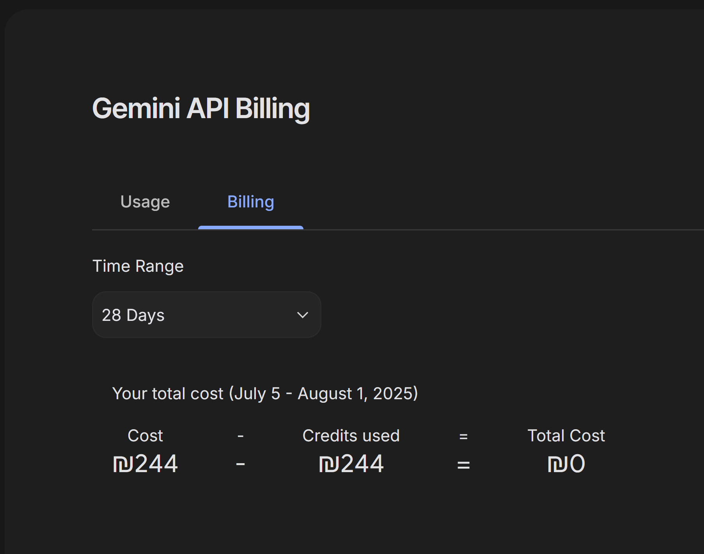

# Deep Intent Search
Search algorithm that rivals the accuracy of a human reading through an article and highlighting relevant sections with a yellow marker

## Introduction

### My Solution
I can't afford missing **any** relevant information in the series of text documents I present, so I introduce `Deep Intent Search`.

My [search process](#search-through-the-chunks) takes advantage of the accurate language understanding that LLMs exhibit at short context lengths (<1024 tokens).

### Existing Alternatives

- 📏 Long context-length LLMs

- 🌲 Utilizing embedding LLMs to create a vector database.

- 🔢 Classic keyword-based lexical search algorithms

## Create .env

Create [.env](./.env) file containing:

```md
GOOGLE_AISTUDIO_API_KEY=XX123XX123_XXX123XXXXX123XXXXXXX123XXXX
CONTEXT_WINDOW_SIZE_TOKENS=8192
```

## Split the file(s)

The input to the search are text file(s). Say you have a PDF- you'll have to first convert that into a text file.

Use [semantic_splitter.py](./semantic_splitter.py) utility to create a folder at [./split](./split/).
A group of files with naming convention `[000001.txt, 000002.txt, ...]` will be created.

The splitting logic is done by utilizing structured output from `Gemini 2.5 Flash` in a recursive approach, to split the file(s) into small chunks as the LLM sees fit.

```powershell
PS C:\Users\user\Downloads\deep_intent_search> python semantic_splitter.py --file "C:\Users\user\Downloads\tanakh\Prophets\Amos\Hebrew\Tanach with Text Only.txt" "C:\Users\user\Downloads\tanakh\Prophets\Ezekiel\Hebrew\Tanach with Text Only.txt" [...total 39 files]
--- Splitting file: C:\Users\user\Downloads\tanakh\Prophets\Amos\Hebrew\Tanach with Text Only.txt ---
Original token count: 4848
Max tokens per chunk: 1024

Warning (Attempt 1): LLM-suggested string not found in text.
Retrying LLM call...
Warning (Attempt 2): LLM proposed a highly imbalanced split (0.71%) of 10281 chars. Discarding.
LLM identified a valid split point. Split 10281 chars at 2261 (22.0%).
LLM identified a valid split point. Split 2261 chars at 1152 (51.0%).
Warning (Attempt 1): LLM-suggested string not found in text.
Retrying LLM call...
LLM identified a valid split point. Split 8020 chars at 1015 (12.7%).
LLM identified a valid split point. Split 7005 chars at 1088 (15.5%).
LLM identified a valid split point. Split 5917 chars at 2480 (41.9%).
--- File 'C:\Users\user\Downloads\tanakh\Prophets\Amos\Hebrew\Tanach with Text Only.txt' split into 9 chunks. Saving... ---
--- Splitting file: C:\Users\user\Downloads\tanakh\Prophets\Ezekiel\Hebrew\Tanach with Text Only.txt ---
Original token count: 45281
Max tokens per chunk: 1024

Text token count (45281) exceeds window size (8192). Creating a central window for the LLM.
LLM identified a valid split point. Split 95022 chars at 50254 (52.9%).
Text token count (24024) exceeds window size (8192). Creating a central window for the LLM.
LLM identified a valid split point. Split 50254 chars at 18444 (36.7%).
[...collapsed 2811 lines]
--- Completed: Split 39 file(s) into a total of 1127 chunks. ---
--- All chunks saved successfully in the 'split/' directory. ---
PS C:\Users\user\Downloads\deep_intent_search>
```

## Search through the chunks
Once you have a folder [./split](./split/) containing ordered chunks of all the files, it's time to perform the deep search.

We'll use [deep_search.py](./deep_search.py) utility to search based on intent, just like a human reading through a book.

The algorithm goes through each chunk (<1024 tokens) while providing up to `CONTEXT_WINDOW_SIZE_TOKENS` surrounding that chunk.

For example, if the current chunk is `000019.txt`, then the contents of surrounding adjacent chunks such as `[000016.txt, ..., 000019.txt, ..., 000022.txt]` will be included. This is important to give the LLM context regarding the meaning and significance of the (current) chunk of interest.

We want to avoid missing any relevant information, so the script makes a new and separate `Gemini 2.5 Flash` LLM completion request focusing on each chunk- meaning each chunk will be fed into the LLM multiple times in practice.

This is the most expensive possible way to search, and it's very unlikely to miss any relevant information about the search query.

Run this command:
```powershell
PS C:\Users\user\Downloads\deep_semantic_chunking> python deep_search.py --query "Interested finding a fully-spelled-out direct explanation of why we should believe in god. I want to find an explicitly stated logical argument- and crucially I'm exclusively interested in an argument that directly addresses the concern of no proof being available for his existence"
Loading and tokenizing all chunks from disk...
Successfully loaded 1127 chunks into memory.

--- Starting Deep Search: Pass 1 (1127 sections to search, Context window: 8192 tokens) ---

Analyzing chunk 1/1127 ('000001.txt')...
  -> LLM decision: Not Relevant

Analyzing chunk 2/1127 ('000002.txt')...
  -> LLM decision: Not Relevant
[...collapsed 3373 lines]
Analyzing chunk 1127/1127 ('001127.txt')...
  -> LLM decision: Not Relevant

================================================================================
Found 47 relevant section(s):
================================================================================

- 000021.txt (Tokens: 933)
- 000034.txt (Tokens: 806)
[...collapsed 44 lines]
- 001049.txt (Tokens: 844)

================================================================================
You can now enter a new query to search within these results.
Press Enter to exit.
================================================================================
Refinement Query (Pass 2) > Looking for arguments of god existing that might still be relevant today, and not dependent on specific ancient people who may or may not have witnessed specific miracles more than 2000 years ago.  

--- Starting Deep Search: Pass 2 (47 sections to search, Context window: 8192 tokens) ---

Analyzing chunk 1/47 ('000021.txt')...
  -> LLM decision: Not Relevant

Analyzing chunk 2/47 ('000034.txt')...
  -> LLM decision: Relevant

[...collapsed 133 lines]
Analyzing chunk 47/47 ('001049.txt')...
  -> LLM decision: Relevant

================================================================================
Found 14 relevant section(s):
================================================================================

- 000034.txt (Tokens: 806)
- 000043.txt (Tokens: 818)
- 000058.txt (Tokens: 820)
- 000062.txt (Tokens: 1033)
- 000305.txt (Tokens: 933)
- 000307.txt (Tokens: 824)
- 000308.txt (Tokens: 1023)
- 000309.txt (Tokens: 866)
- 000310.txt (Tokens: 423)
- 000312.txt (Tokens: 688)
- 000488.txt (Tokens: 908)
- 000798.txt (Tokens: 829)
- 000805.txt (Tokens: 1038)
- 001049.txt (Tokens: 844)

================================================================================
You can now enter a new query to search within these results.
Press Enter to exit.
================================================================================
Refinement Query (Pass 3) >
```

We've found 14 relevant sections, which are 11,853 tokens combined.
I've uploaded [the final search results](./tanakh_search_results.txt) of this example.

## Future Research

😱 Running the tool is very expensive. Observed to cost upwards of $5 USD for every search pass on the 7 books of Harry Potter.



Given that, future project goals could be-
- Generate an extremely high-quality dataset of search results, will require generating synthetic intent-oriented search queries. Even if the synthetic intent-oriented search queries aren't extremely high-quality, the search results are the outcome of so much processing power `ThinkingConfig(thinking_budget=-1)` that the generated dataset will contain concentrated intelligence traces.

- Add **ELO tournament** scoring for the purpose of ordering the results from most relevant to least relevant.

- Generate high-quality search results dataset **as a benchmark** to test the long context quality in LLM research.

- Generate huge (potentially limitless) high-quality search results dataset to train an LLM-like model to be **natively** good at long-context search, which could be offered as an affordable, scalable and fast alternative to this expensive and rather brute-force approach.

## Usecases

Regardless of the high cost of this brute force approach, there are some legitimate usecases where `Deep Intent Search` can be a gamechanger:

- **RAG**- allows a smart LLM to get the precise information it needs for in-context learning to actually work, as opposed to current RAG implementations that fail at having a model truly learn what it needs to know.

- **Law**- can do the menial job of searching through a large book of laws (or precedents) to find specific sections that are relevant to the case of interest.

- **Police / Intelligence Agencies**- can be a game-changing tool for professional detectives that might read through boring logs and reports, 99% of which are not relevant to the case being researched.

- **Cybersecurity**- can read through network logs to identify suspicious activity.

- **Messaging Apps**- make Telegram search actually work.

- **Image Search**- This technology in essense should work with other media formats other than text.

## Fundamental Limitation

What if the LLM doesn't fully understand the text?

When a human reads text, we might learn new concepts that enter our long-term memory, then upon the second read we will actually be able to better-understand the text and more accurately mark relevant sections with a yellow marker.

Thanks to human's long-term learning, we can also link two distant parts of the text to gain additional insights and context. Classic example is learning new terminology from context in one part of a report, to understand another part of the report much more accurately.

Current LLM technology only has in-context learning, which starts degrading in quality when surpassing ~4096 tokens.\
Training an LLM on a piece of text will not help it learn the specific information at all, because LLMs can only learn from being presented the same information in multiple different contexts, wordings and formats.

For example- the reason most LLMs can accurately describe specific plot points in Harry Potter is hardly the result of the LLM training on the English text of Harry Potter. It's actually thanks to the discussion forums, hints in cultural references, summaries, book reports, and literary analyses that all help the LLM memorize the plot line details of Harry Potter. The information has to exist in multiple contexts, wordings and formats for the LLM to actually learn and not just overfit.

That's why current LLMs cannot learn any specific information by training, only in-context learning.

This can be observed in humans. A human who tries to memorize a sentence without thinking about the meaning, will not memorize the meaning of that sentence. They might be able to repeat the sentence, but definitely not use its contents as part of a thought process.\
Memorization of a piece of text into long-term memory on-demand will always reuqire a human to make a conscious effort to find strong mental connections to existing brain circuits. A human might think about the information in a diverse set of ways, ask questions about the information in their internal dialogue, and consciously / subconsciously find connections to existing knowledge- In LLM lingo this might be called "synthetic information expansion for self-training".

Once we solve that problem, we will have AGI- In current LLM architectures the weights are static. Imagine if LLMs were constantly trained on the output of the LLM itself during pretraining, instead of bring trained on the raw text they can be trained on the LLMs thoughts regarding that text. Somehow train the LLM to truly memorize and understand pieces of information by optimally blabbering about the topic, A.K.A "synthetic information expansion for self-training". The problem is we need to find a robust mechanism that will be the LLM have an incentive to optimally think about text while it's learning it.
